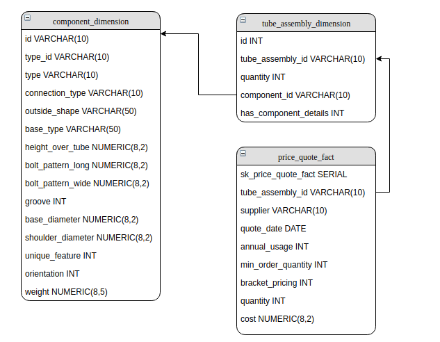

## Modelo de preços de indústria

Esse projeto limpa e carrega alguns arquivos texto (csv) para um banco de dados postgres.

*Leia em outros idiomas: [Inglês](README.md).*

### Instalação (somente para desenvolvimento):

1) Crie uma virtualenv com python 3.5;
1) Adicione os arquivos .csv na pasta 'data';
1) Instale o arquivo de requerimentos: \
_Importante: Execute os comandos a seguir dentro do diretório do projeto !_
```
pip install -r requirements.txt
```

### Executando:
 
1) Inicie um banco postgres com docker e todas as tabelas já criadas (em branco);
1) Inicie o processo python (não esqueça de checar se os arquivos csv estão na pasta correta) \
_Importante: Execute os comandos a seguir dentro do diretório do projeto !_
```
make db-up
make run
```

### Árvores de diretórios do projeto:

- data/: Arquivos csv de origem;
- db/: Modelo do banco de dados e configuração de docker para ele;
- dw/: ETL para as tabelas do data warehouse;
- util/: Outras funções;

### Modelo do BD:



- component_dimension: 
	- Contém todos os dados de comp_boss.csv. Todas as colunas boolean for convertidas para 1 ou 0;
	- Todos os valores N/A foram padronizados;
	- Todas as string ficaram com letras maiúsculas;
- tube_assembly_dimension:
	- Contém os dados de bill_of_materials;
	- Colunas foram 'tombadas' (unpivot) para remover valores nulos e simplificar futuras agregações;
- price_quote:
	- Contém dados de price quote;
	- Tem uma outra tabela chamada 'annual_cost' que aplica os cálculos de custo anual.
	
### To do / A Fazer:
Essa seção contém possíveis melhorias para esse projeto:
- Adicionar um framework para controlar o fluxo (e.g: luigi, apache airflow);
- Criar testes de unidade e de integração;
- Criar scripts de CD (entrega contínua) para construir e implantar a imagem docker no docker hub;
- Automatizar deploy em caso de múltiplas execuções.
